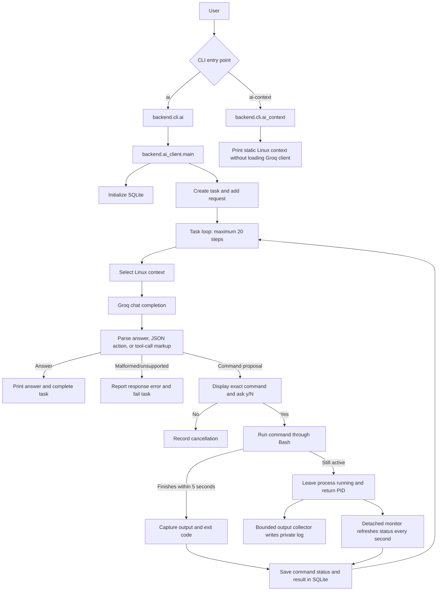

# Linux AI Agent Architecture

This document describes how the current Linux AI Agent implementation handles
a request, how an approved command is executed, and what each Python module in
`backend/` is responsible for.

## At a glance

The program is a command-line agent, not a server. It gathers selected local
Linux facts, asks the configured Groq model to answer or propose one command,
and waits for the user to approve that command before running it through Bash.
Task, command, output, and long-running process information are stored locally
in SQLite and under the user's `~/.linux_ai_agent/` directory.

## Request flow



The diagram shows the normal flow. The task loop can finish with an answer,
stop on cancellation or an error, or stop at its 20-step limit.

## Step-by-step request lifecycle

1. **CLI entry.** The package entry points call `backend.cli.ai` or
   `backend.cli.ai_context`. `ai()` imports the AI client lazily, so
   `ai-context` can run without Groq credentials.
2. **Configuration and database.** The AI client loads
   `~/.linux_ai_agent/.env`, requires `GROQ_API_KEY` and `GROQ_MODEL`, creates
   the Groq client, and initializes `~/.linux_ai_agent/agent.db`.
3. **Task creation.** For an `ai` request, the client creates a task record and
   adds the user request to the current conversation.
4. **Context and prompt.** Each task-loop step selects static system facts and
   relevant dynamic context. The client assembles these with conversation
   messages and recent command history.
5. **Model response.** The response parser accepts a valid JSON answer or
   command action, or a standalone recognized `execute_bash` tool-call block.
   Plain text is treated as an answer. Malformed structured responses are
   rejected rather than executed.
6. **Approval boundary.** A command action is passed to the command classifier
   and then displayed for explicit `y` or `yes` approval. Declining cancels
   the task. No parser or model response skips this prompt.
7. **Execution.** An approved command runs under `/bin/bash`. If it exits
   within five seconds, the executor returns its exit status and captured
   output. If it remains active, the agent leaves it running and returns its
   PID, process-group ID, startup output, and private log path.
8. **Long-running work.** An output collector continuously drains the command's
   combined stdout/stderr into a log capped at 1 MiB. A detached monitor
   refreshes the command and process status every second, stores updated output
   and exit information in SQLite, and removes completed-command logs after
   seven days.
9. **Feedback and completion.** The command result is stored and fed into the
   next model step. The model can request another approved command or return a
   final answer.

## Architecture and boundaries

```text
┌──────────────────────────── User ─────────────────────────────┐
│                                                               │
│  ai "request" / ai / ai --troubleshoot       ai-context       │
└──────────────┬──────────────────────────────────┬─────────────┘
               │                                  │
               v                                  v
       backend.cli.ai()                   backend.cli.ai_context()
               │                                  │
               v                                  v
       backend.ai_client                 backend.context
          │       │       │                       │
          │       │       └── task state          └── static facts
          │       │           SQLite
          │       v
          │   backend.context ───────> selected host facts
          v
       Groq API
          │ answer/action
          v
       backend.action
          │ proposed command
          v
       backend.agent ──> backend.approval ── y/N checkpoint
          │ approved
          v
       backend.executor ──> /bin/bash
          │
          ├── completed command ────────────────> SQLite result
          │
          └── long-running command
                 ├── output pipe ──> output_collector ──> capped private log
                 ├── process_monitor ──> process status / SQLite updates
                 └── task loop receives PID, status, and captured output
```

The approval prompt is a user checkpoint, not a sandbox. Commands are passed
to Bash with shell syntax enabled. The current command classifier labels each
non-empty command `USER_APPROVAL`; it does not determine whether a command is
safe or dangerous.

## Backend module reference

| Module | Responsibility |
| --- | --- |
| [`__init__.py`](./backend/__init__.py) | Marks `backend` as the Python package. |
| [`action.py`](./backend/action.py) | Normalizes model output into answer or command actions. Supports valid JSON actions and standalone recognized `execute_bash` tool-call markup; rejects malformed structured responses. |
| [`agent.py`](./backend/agent.py) | Implements the command boundary: parse the proposed action, classify it, request approval, execute only after approval, and return a status/result record. |
| [`ai_client.py`](./backend/ai_client.py) | Loads Groq configuration, defines model instructions, sends chat-completion requests, assembles context/history, drives the task loop, and persists results. |
| [`approval.py`](./backend/approval.py) | Displays the exact proposed command and requires an explicit `y` or `yes`; any other input declines. |
| [`cli.py`](./backend/cli.py) | Defines `ai` and `ai-context` package entry points. Lazily imports the AI client only for `ai`. |
| [`command.py`](./backend/command.py) | Extracts familiar Linux command-looking fragments from text. It is a helper, not the active model-response/action parser. |
| [`command_safety.py`](./backend/command_safety.py) | Rejects empty commands and labels non-empty commands `USER_APPROVAL`; it does not perform risk analysis. |
| [`context.py`](./backend/context.py) | Collects cached static host facts and selected dynamic facts such as location, storage, resources, network listeners, processes, and services. |
| [`conversation.py`](./backend/conversation.py) | Appends chat messages, bounds the retained conversation history, and compacts long result text. |
| [`executor.py`](./backend/executor.py) | Starts approved commands under `/bin/bash`, captures output, returns completed results, or hands back process identifiers and log metadata for commands still active after five seconds. |
| [`output_collector.py`](./backend/output_collector.py) | Drains command stdout/stderr without blocking the command and writes at most 1 MiB to its private log, adding a truncation marker if output exceeds the limit. |
| [`process_monitor.py`](./backend/process_monitor.py) | Runs detached from the interactive task loop, refreshes a tracked process once per second, and triggers cleanup of expired completed-process logs. |
| [`task_state.py`](./backend/task_state.py) | Creates/migrates the SQLite schema and stores task, command, result, and process records; refreshes process state and applies log retention. |

## Persistence and files

- **Configuration:** `~/.linux_ai_agent/.env` (`GROQ_API_KEY`, `GROQ_MODEL`).
- **Database:** `~/.linux_ai_agent/agent.db`.
- **Long-running command logs and status files:**
  `~/.linux_ai_agent/processes/`.
- **Static context cache:** `~/.linux_ai_context.json`.
- **Installer environment:** `/opt/linux-ai-agent/venv`, with CLI entry points
  linked under `/usr/local/bin`.

## Tests

Run the suite from the repository root:

```bash
python -m pytest -q
```

The focused tests cover action parsing and approval behavior, ordinary command
execution, long-running process monitoring, bounded output logs, and log
retention.
